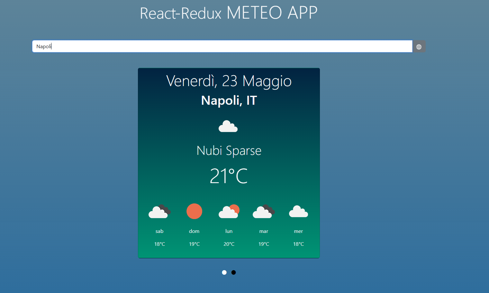
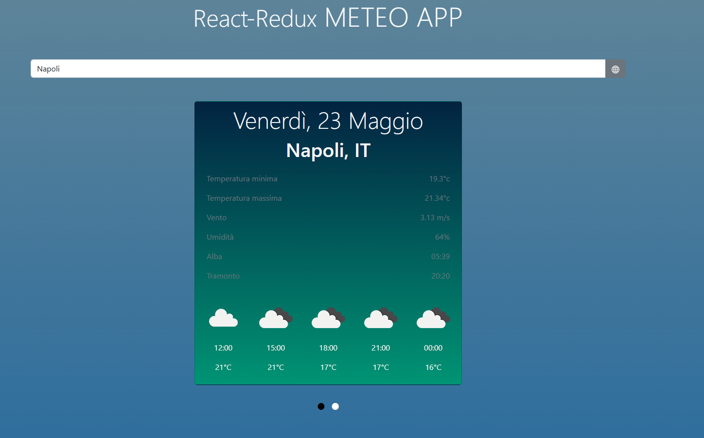

# 🌤️ Meteo App con React + Redux

Un'applicazione meteo moderna sviluppata con **React**, **Redux Toolkit** e **Bootstrap**. Permette di cercare il meteo attuale di qualsiasi località e visualizzare previsioni giornaliere e orarie tramite un'interfaccia moderna.

## 🖼️ Screenshot





---

## 🚀 Tecnologie utilizzate

- ⚛️ ***React***
- 📦 ***Redux Toolkit***
- 🎨 ***Bootstrap***
- 🌐 ***OpenWeather API***

---

## 📸 Funzionalità

- 🔍 Ricerca città con aggiornamento automatico del meteo
- 📍 Meteo attuale (temperatura, descrizione, icona, località)
- 📅 Previsioni giornaliere (5 giorni)
- ⏰ Previsioni orarie (prossimi blocchi da 3h)
- 🧭 Interfaccia a "card" con switch
- 📱 Design responsive

---

## 🛠️ Come avviare il progetto in locale

### 1. Clona il repository

```bash
git clone https://github.com/tuo-username/meteo-app.git
```

### 2. Installa le dipendenze

```bash
npm install
```

### 3. Ottieni la tua API key da OpenWeather

Registrati su openweathermap.org e copia la tua API key.

### 4. Aggiorna API key in /redux/reducers/index.js

All'inizio di questo file troverai :

```bash
const API_KEY = "inserisci_la_tua_API_KEY";
```

sostituendo "inserisci_la_tua_API_KEY" l'applicazione funzionerà correttamente

### 5. Avvia l'applicazione da terminale digitando

npm start

# 👨‍💻 Autore
Realizzato da Aniello Casolla – 07/03/2023.

# 📌 Note
Questo progetto fa parte del mio percorso di apprendimento ed è stato creato per esercitarmi con React Bootstrap e Redux. Qualsiasi feedback è benvenuto!